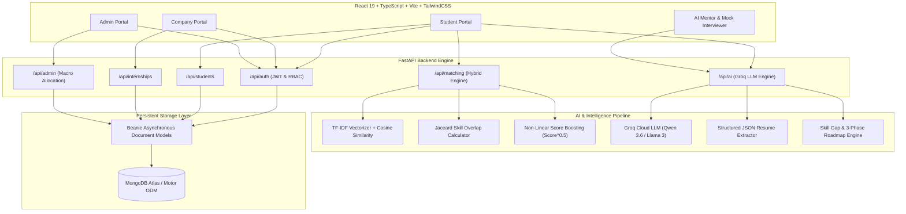

# 🇮🇳 Skill-Sync AI: Smart Allocation Engine for PM Internship Scheme
### 🏆 Smart India Hackathon (SIH) | Next-Gen AI Allocation & Career Enablement Platform

[](LICENSE)
[](https://python.org)
[](https://fastapi.tiangolo.com)
[](https://react.dev)
[](https://www.typescriptlang.org)
[](https://vitejs.dev)
[](https://www.mongodb.com)
[](https://groq.com)

---

## 📌 Executive Summary & Problem Context

The **Prime Minister's Internship Scheme (PMIS)** is a flagship national initiative aimed at providing **1 Crore youth** with transformative 12-month internship opportunities across India's top 500 companies. 

However, scaling this nationwide initiative presents critical operational bottlenecks:
1. **Massive Scale & Screening Friction:** Millions of applicants vs. thousands of diverse corporate internship roles cannot be manually or conventionally matched without severe drop-offs and misallocations.
2. **Skill-Opportunity Mismatch:** Students often lack clear visibility into the exact technical/domain skills required for enterprise roles.
3. **Equitable Representation:** Ensuring fair geographic (Urban vs. Rural), demographic (Gender parity), and institutional (Tier-1 vs. Tier-2/Tier-3 colleges) representation without compromising merit.
4. **Candidate Readiness Deficit:** Candidates from underserved regions lack personalized interview preparation, resume polishing, and upskilling roadmaps.

---

## 💡 The Solution: Skill-Sync AI

**Skill-Sync AI** is an end-to-end, intelligent multi-agent platform designed to power the PM Internship Scheme. It combines **Natural Language Processing (NLP)**, **Hybrid Machine Learning Matching Algorithms**, **Generative AI Mentorship (Groq / Qwen / Llama 3)**, and **Multi-Tenant Portals** to deliver:
- 🎯 **Transparent, Merit-Driven & Affirmative AI Allocation**
- 📊 **Real-Time Diversity & Geographic Equity Analytics**
- 🧠 **AI-Powered Upskilling, Resume Parsing & Skill-Gap Analysis**
- 🎙️ **Interactive AI Mock Interviewer with Instant Diagnostic Reports**
- 🏢 **Enterprise Recruiter Cockpit for Frictionless Candidate Discovery**

---

## 🏛️ System Architecture



---

## ✨ Key Modules & Capabilities

### 1. 🎓 Student Empowerment Hub
- **AI Resume Auto-Parser:** Upload or paste raw text to extract structured skills, projects, certifications, strengths, and actionable feedback in pure JSON format.
- **Skill Gap Diagnostics:** Real-time side-by-side comparison between student proficiencies and target internship requirements, categorized by priority (*High, Medium, Low*) and estimated completion time.
- **3-Phase Personalized Learning Roadmap:** Curated roadmap covering Foundations, Applied Engineering, and Portfolio Readiness with suggested courses, capstones, and certifications.
- **InternAI Career Mentor:** 24/7 contextual conversational mentor for profile advice, STAR-method resume bullet suggestions, and industry guidance.
- **AI Mock Interview Studio:** Practice role-specific behavioral and technical questions with instant scoring on clarity, confidence, keyword usage, and detailed actionable takeaways.
- **Continuous Score Simulator:** Complete practical mini-projects to dynamically boost allocation readiness and trigger live notifications.

### 2. 🏢 Corporate Recruiter Portal
- **Streamlined Internship Creation:** Create listings with required competencies, domain sector, stipend, openings, location, and preferred organization tiers.
- **AI Match Ranking & Talent Pipeline:** Instant ranked list of applicant match percentages based on vector similarity and skill overlap.
- **Comprehensive Candidate Dossier:** Deep-dive into student profile summaries, verified credentials, projects, and interview ratings.

### 3. 🛠️ Scheme Administration & Macro Allocation
- **Automated Macro-Allocation Engine:** One-click batch allocation balancing skill compatibility, student preferences, and organizational capacity.
- **Diversity & Inclusivity Cockpit:** Real-time analytics on:
  - ⚧️ **Gender Balance** (Female / Male / Other distribution)
  - 🏞️ **Regional Equity** (Urban vs. Rural representation)
  - 🏛️ **Institutional Diversity** (Tier-1, Tier-2, and Tier-3 college quotas)
- **User Governance & Audit Logs:** Role assignment, account state control, and system health telemetry.

---

## 🧮 AI Matching Algorithm Deep-Dive

Skill-Sync AI utilizes a **Hybrid Multi-Factor Scoring Engine** that prevents cold-start issues and ensures holistic matching:

$$\text{Raw Score} = (0.30 \times \text{Semantic Vector Similarity}) + (0.70 \times \text{Skill Overlap Ratio})$$

$$\text{Final Match Score} = (\text{Raw Score})^{0.5} \times 100$$

1. **Semantic Text Representation:** Vectorizes candidate goals, skills, and industry preferences alongside internship role descriptions using `TfidfVectorizer(stop_words='english')`.
2. **Cosine Similarity ($S_{\text{vector}}$):** Evaluates overall contextual alignment between profile aspirations and role descriptions.
3. **Skill Coverage Ratio ($S_{\text{skill}}$):** Direct set intersection measuring the percentage of mandatory competencies satisfied:
   $$S_{\text{skill}} = \frac{|\text{Student Skills} \cap \text{Required Skills}|}{|\text{Required Skills}|}$$
4. **Non-Linear Boosting Curve:** Square-root compression ensures students with strong foundational skills receive encouraging, realistic match scores (e.g., $0.50 \to 70.7\%$, $0.80 \to 89.4\%$).

---

## 🛠️ Technology Stack

| Layer | Technology | Purpose |
| :--- | :--- | :--- |
| **Frontend Framework** | **React 19.1 + TypeScript 5.8** | Modern reactive component architecture |
| **Styling & Icons** | **Tailwind CSS + Lucide React** | Responsive, accessible, dark/light theme UI |
| **Client Bundler** | **Vite 6.2** | Blazing-fast HMR and optimized production bundling |
| **Backend REST API** | **FastAPI 0.128 + Uvicorn** | High-performance asynchronous Python API |
| **Database & ODM** | **MongoDB + Motor + Beanie** | Asynchronous NoSQL document persistence |
| **AI LLM Inference** | **Groq Cloud API** (`qwen/qwen3.6-27b`, `groq/compound`) | Sub-second ultra-fast LLM responses |
| **Machine Learning** | **Scikit-Learn + NumPy** | TF-IDF vectorization & Cosine similarity matching |
| **Security & Auth** | **JWT (JSON Web Tokens) + Passlib/Bcrypt** | Role-Based Access Control (RBAC) |

---

## 🚀 Quick Start & Installation

### Prerequisites
- **Node.js** (v18.0 or higher) and `npm`
- **Python** (v3.9 or higher)
- **MongoDB** (Local instance on `mongodb://localhost:27017` or MongoDB Atlas URI)

---

### Step 1: Clone the Repository
```bash
git clone https://github.com/DHARSHAN-PARAMASIVAN/Smart-Allocation-Engine-for-PM-Internship-Scheme.git
cd Smart-Allocation-Engine-for-PM-Internship-Scheme
```

---

### Step 2: Backend Setup
```bash
# Navigate to backend directory
cd backend

# Create & activate a virtual environment (recommended)
python -m venv venv
# On Windows:
venv\Scripts\activate
# On Linux/macOS:
source venv/bin/activate

# Install dependencies
pip install -r requirements.txt

# (Optional) Seed the database with sample students and internships
python seed_db.py

# Start the FastAPI backend server
uvicorn app.main:app --reload --port 8000
```
- 📡 **Backend API:** `http://127.0.0.1:8000`
- 📖 **Interactive Swagger UI:** `http://127.0.0.1:8000/docs`
- 📑 **ReDoc Documentation:** `http://127.0.0.1:8000/redoc`

---

### Step 3: Frontend Setup
```bash
# In the root project directory (in a new terminal):
npm install

# Start Vite development server
npm run dev
```
- 🌐 **Frontend Application:** `http://localhost:5173`

---

## 🔑 Demo Accounts for Jury & Testing

Use the quick-fill buttons on the login page or enter the credentials below:

| Role | Email | Password | Access Highlights |
| :--- | :--- | :--- | :--- |
| **Student** | `student@example.com` | `password123` | AI Recommendations, Resume Parser, Upskilling Hub, Mock Interview |
| **Company** | `company@example.com` | `password123` | Post Internships, View Ranked Applicants, Shortlist Candidates |
| **Admin** | `admin@example.com` | `password123` | Macro-Allocation Engine, Diversity Dashboard, Scheme Analytics |

---

## 📊 SIH Jury Presentation & Pitch Assets

This repository includes full pitch materials prepared for the Smart India Hackathon jury evaluation:

- 📽️ **PowerPoint Presentation (`.pptx`):** [`SIH_Presentation.pptx`](./SIH_Presentation.pptx) *(12-slide polished SIH deck)*
- 🌐 **Interactive Web Presentation:** [`SIH_Presentation.html`](./SIH_Presentation.html) *(Open in any browser for full-screen slide deck with timer & animations)*
- 📝 **Pitch Script & Jury Q&A Guide:** [`PRESENTATION_SCRIPT.md`](./PRESENTATION_SCRIPT.md) *(5-7 min speaker notes + answers to tough questions)*

---

## 🔌 API Reference Summary

| Method | Endpoint | Description |
| :--- | :--- | :--- |
| `POST` | `/api/auth/register` | Register new user (Student / Company / Admin) |
| `POST` | `/api/auth/login` | Authenticate user and issue JWT token |
| `GET` | `/api/students/me` | Fetch active student profile and preferences |
| `GET` | `/api/internships/` | List all verified corporate internships |
| `POST` | `/api/internships/` | Post a new internship opportunity |
| `POST` | `/api/matching/recommendations` | Compute top ranked internships for a candidate |
| `POST` | `/api/matching/score/{id}` | Compute exact hybrid match score for a specific role |
| `POST` | `/api/ai/analyze-resume` | Extract structured profile data from raw resume text |
| `POST` | `/api/ai/skill-gap` | Calculate missing skills with priority ratings |
| `POST` | `/api/ai/roadmap` | Generate 3-phase customized learning roadmap |
| `POST` | `/api/ai/chat` | Context-aware career mentorship via Groq LLM |
| `GET` | `/api/admin/metrics` | Macro scheme statistics and diversity breakdown |
| `POST` | `/api/admin/allocate` | Execute global allocation matching routine |

---

## 🌟 Innovation & Competitive Advantage

| Feature | Traditional Portals (Naukri, Internshala) | Skill-Sync AI (PM Scheme Engine) |
| :--- | :--- | :--- |
| **Matching Logic** | Basic keyword filtering / Recency | Hybrid Semantic NLP + Jaccard Skill Overlap + Non-linear boosting |
| **Affirmative Equity** | None / Manual | Automated Diversity & Inclusion Optimization (Rural/Tier-3/Gender) |
| **Candidate Uplift** | Static links / Paid upsells | Built-in AI Resume Parser, Skill Gap Analyzer & 3-Phase Roadmap |
| **Interview Readiness** | External third-party tools | Real-time AI Mock Interview Studio with instant feedback scores |
| **Government Scale** | Commercial & Ad-driven | Designed for National Scale (1 Crore Youth, 500+ Top Enterprises) |

---

## 👥 Authors & Acknowledgements

- **Developed for:** Smart India Hackathon (SIH)
- **Problem Statement:** Smart Allocation Engine for PM Internship Scheme
- **Lead Developer & Maintainer:** [DHARSHAN-PARAMASIVAN](https://github.com/DHARSHAN-PARAMASIVAN)
- **Repository:** [https://github.com/DHARSHAN-PARAMASIVAN/Smart-Allocation-Engine-for-PM-Internship-Scheme.git](https://github.com/DHARSHAN-PARAMASIVAN/Smart-Allocation-Engine-for-PM-Internship-Scheme.git)

---

## 📄 License

This project is licensed under the **MIT License** - see the [LICENSE](LICENSE) file for details.
